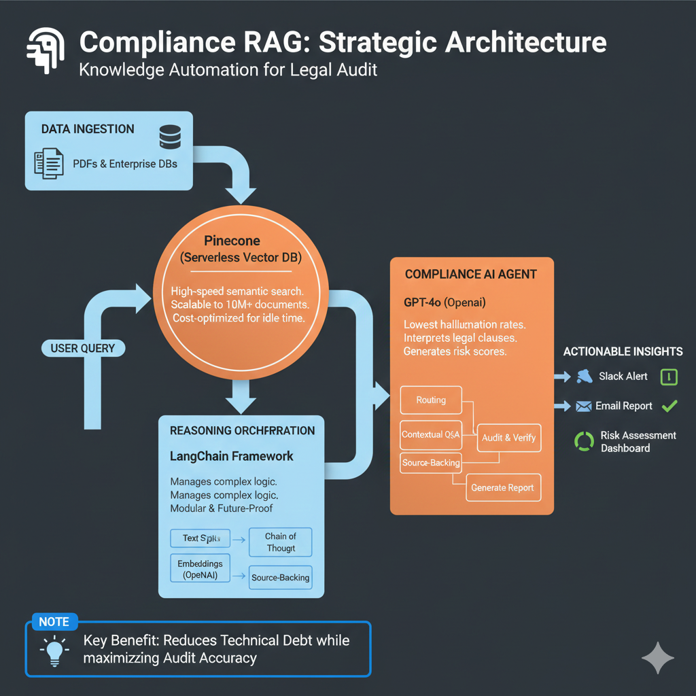

# Project 1: Enterprise Compliance RAG "Expert" 📚
> **Category:** Knowledge Intelligence / Information Retrieval

### *Automated Document Auditing & Risk Assessment*

> [!TIP]
> **Strategic Impact:** Reduces manual audit time by **90%**. This system transforms static PDF policies into an interactive "Compliance Brain" that identifies risks in seconds.

## 💼 Business Use Case
Large enterprises and SMBs struggle with "Information Silos." Employees spend hours searching through hundreds of IT policies, SOC2 compliance docs, and legal contracts. This project solves that by creating a **Retrieval-Augmented Generation (RAG)** system that provides instant, cited answers based *only* on internal company data.

## 🛠️ Tech Stack
- **Language:** Python
- **Orchestration:** LangChain / LlamaIndex
- **Vector Database:** Pinecone (or Weaviate)
- **Model:** OpenAI GPT-4o / Claude 3.5 Sonnet
- **Security:** Private data indexing (No public training)

## 📖 Step-by-Step Build Path
Follow these three modules to complete this project:

1. **Morning (Theory):** - Watch: [Intro to Large Language Models (DeepLearning.AI)](https://www.youtube.com/watch?v=zjkBMFhNj_g)
   - *Goal:* Understand how embeddings and vector search work.

2. **Afternoon (Architecture):** - Watch: [RAG Explained: From Beginner to Advanced](https://www.youtube.com/watch?v=o126p1QN_RI)
   - *Goal:* Map out the "Load -> Chunk -> Embed -> Store" pipeline.

3. **Evening (Implementation):**
   - Resource: [Build a RAG chatbot (n8n, Pinecone, Lovable)](https://lnkd.in/dew--RqD)
   - *Goal:* Build a prototype that can "read" a PDF and answer questions accurately.
  

## ⚖️ Why This Tech Stack?

In an enterprise environment, "cool" isn't enough. I chose these tools for **Reliability, Scalability, and ROI.**

* **LangChain:** I chose this over custom logic to ensure the system is **future-proof.** It allows us to swap LLMs or vector stores in minutes without a total rewrite.
* **Pinecone (Serverless):** Unlike local databases (FAISS), Pinecone handles the infrastructure. It’s built for **Production-Grade scaling** and keeps costs low for SMEs.
* **OpenAI GPT-4o:** Compliance requires high reasoning accuracy. GPT-4o provides the **lowest hallucination rates** for complex legal and audit documents.
* **Python:** The industry standard. It ensures the fastest deployment and easiest integration with existing enterprise security frameworks.

> [!NOTE]
> This stack was selected to minimize **Technical Debt** while maximizing **Audit Accuracy.**

## 🎯 Consultant's Key Features
- **Citations:** Every answer includes the page number and document name (Source Attribution).
- **Accuracy:** Prevents hallucinations by forcing the model to only use the provided context.
- **ROI:** Estimated 80% reduction in time spent on internal policy inquiries.

---
*Note: This project is part of my 2026 AI Solutions Architecture Roadmap.*
